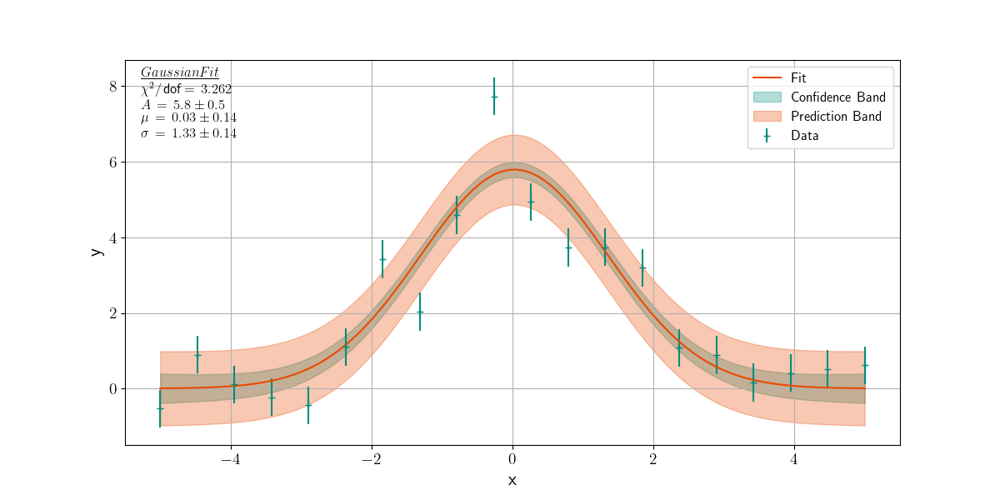

# lumière

A python wrapper of misc. scipy, numpy and matplotlib operations to streamline scientific data handling. 

The scipy ODR and OLS fitting methods are combined into one one `fit` function.
Also functions for the calculation of the [prediction and confidence](https://en.wikipedia.org/wiki/Confidence_and_prediction_bands) bands of two dimensional data is provided.

## Example



```python
import numpy as np
import matplotlib.pyplot as plt
import lumiere as lm


# Load the custom style
lm.loadstyle(True)


# Define the Gaussian function
def gaussian_func(x, a, b, c):
    return a * np.exp(- 0.5 * (x - b)**2 / c**2)

# Generate some sample data
a0, b0, c0 = 5, 0, 1.5
p0  = [a0, b0, c0]

x = np.linspace(-5, 5, 20)
y = gaussian_func(x, *p0) + 1*np.random.randn(20)
yerr = 0.5*np.ones_like(y)

# Fit the Gaussian function
params, param_errs, out = lm.fit(gaussian_func, x, y, yerr=yerr, p0=p0, return_out=True)


# Create a figure and plot the data and fit
fig, ax = plt.subplots()
ax.errorbar(x, y, yerr=yerr, fmt='+', label='Data')
xfit = np.linspace(x.min(), x.max(), 100)
yfit = gaussian_func(xfit, *params)
ax.plot(xfit, yfit, label='Fit')

# Calculate and plot the confidence and prediction bands
conf_band = lm.confidenceband(xfit, x, y, params, gaussian_func)
pred_band = lm.predictionband(xfit, x, y, params, gaussian_func)
ax.fill_between(xfit, yfit - conf_band, yfit + conf_band, color='C0', alpha=0.3, label='Confidence Band')
ax.fill_between(xfit, yfit - pred_band, yfit + pred_band, color='C1', alpha=0.3, label='Prediction Band')

# Add the fit information to the plot
lm.fitinfo('A, \mu, \sigma', out, 'Gaussian Fit', ax=ax)
lm.labels('x', 'y')
ax.legend()
plt.show()
```
